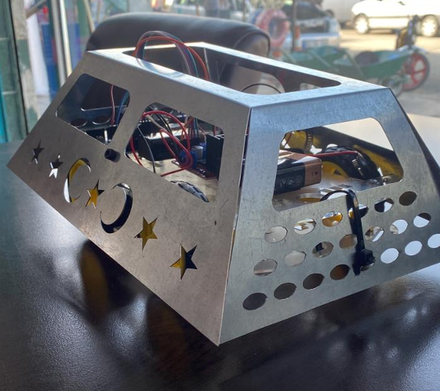

# Arduino Bluetooth Controlled Robot Car

An Arduino Uno based Bluetooth-controlled robot car developed using the HC-06 Bluetooth module and the L298N motor driver.

The robot receives commands via Bluetooth and performs forward, backward, left, right and stop movements.

---

## Features

- Bluetooth remote control
- Forward movement
- Backward movement
- Left turn
- Right turn
- Stop command
- PWM motor speed control

---

## Hardware Components

| Component | Quantity |
|-----------|----------|
| Arduino Uno | 1 |
| L298N Motor Driver | 1 |
| HC-06 Bluetooth Module | 1 |
| 4WD Robot Chassis Kit | 1 |
| 9V Battery | 1 |
| Jumper Wires | As required |

---

## Pin Configuration

| Arduino Pin | Function |
|-------------|----------|
| 11 | Left Motor Enable |
| 10 | Right Motor Forward |
| 9 | Right Motor Reverse |
| 8 | Left Motor Forward |
| 7 | Left Motor Reverse |
| 6 | Right Motor Enable |

---

## Bluetooth Commands

| Command | Action |
|---------|--------|
| F | Forward |
| B | Backward |
| L | Turn Left |
| R | Turn Right |
| S | Stop |

---

## Images

### Robot

---

## Source Code

The complete Arduino source code is included in this repository.
